1. **Access**:
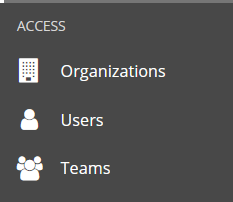

**Organisations:**
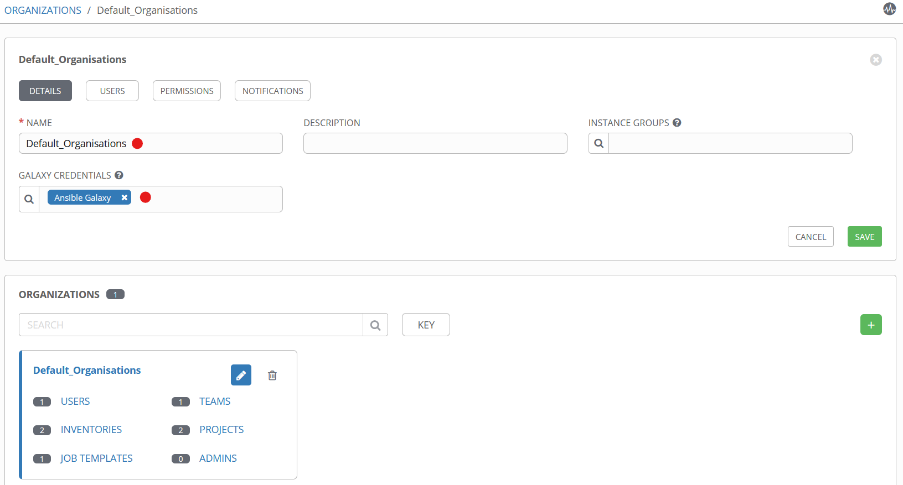

**USERS**
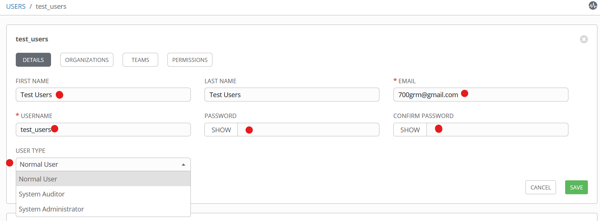

**TEAMS**
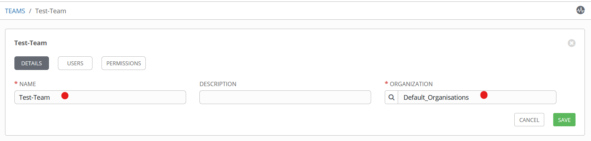

# Resources
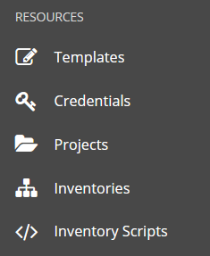
**INVENTORIES**
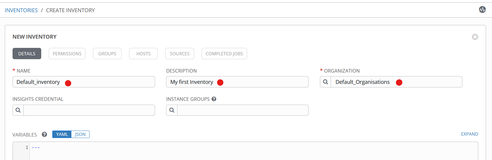

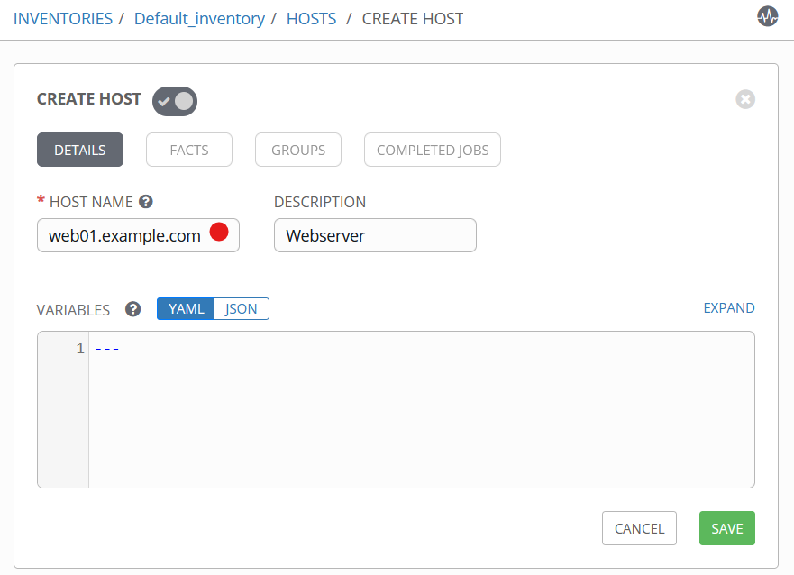

**Populate with hosts:**
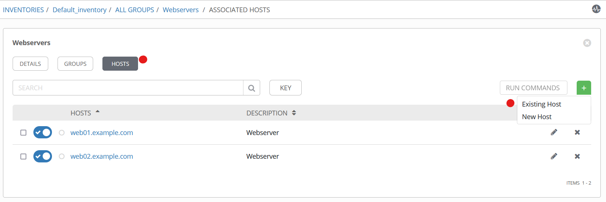

**CREDENTIALS**
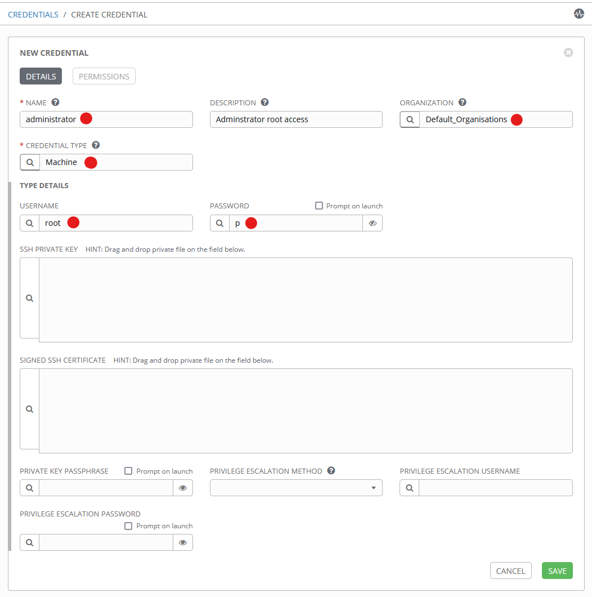

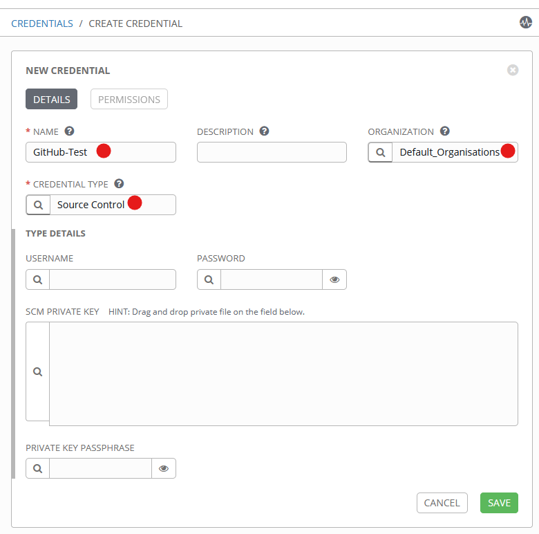


# Projects
**Create Project**
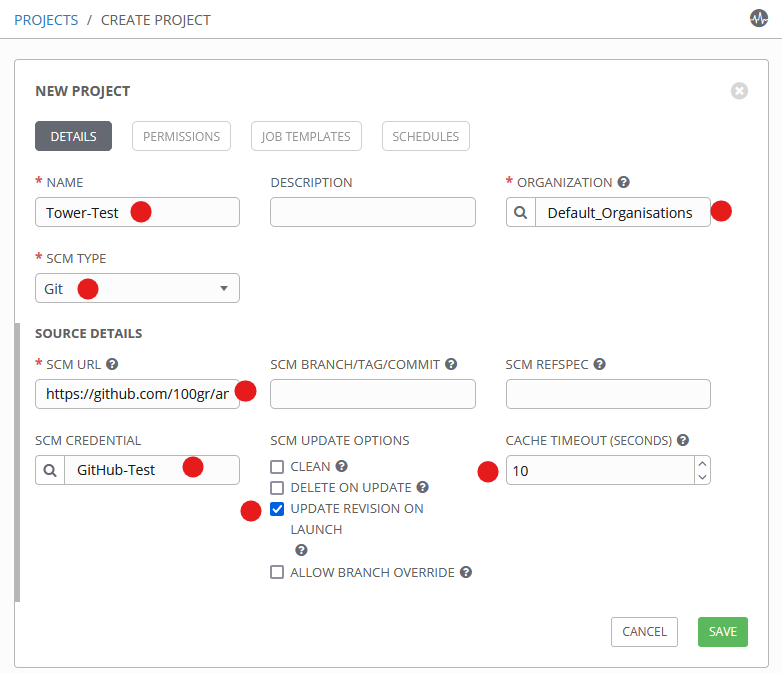

**Job Temlates**
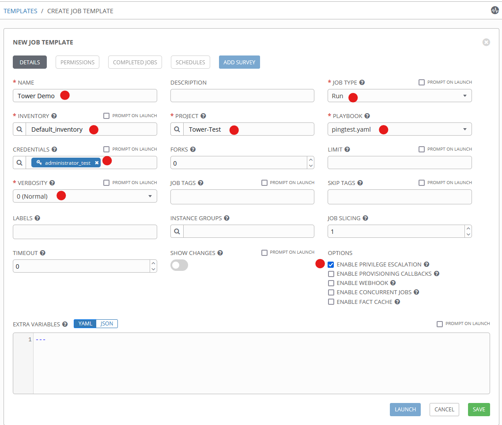


# Controlling Ansible Tower with the API
**From cli**
 ```
curl -X GET 192.168.0.62/api/ -k
{"description":"AWX REST API","current_version":"/api/v2/","available_versions":{"v2":"/api/v2/"},"oauth2":"/api/o/","custom_logo":"","custom_login_info":"","login_redirect_override":""}
```

**Web GUI**
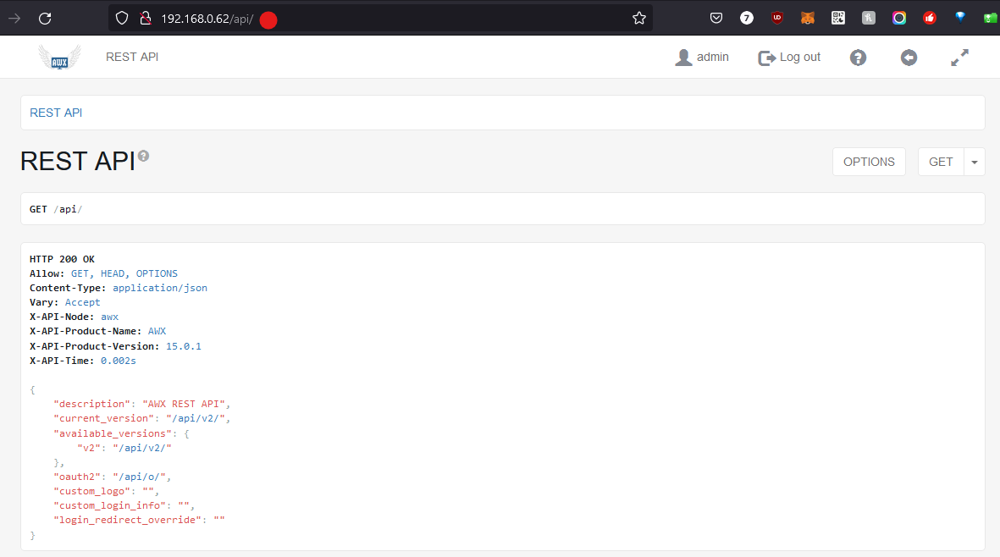

# Troubleshooting 
Controling and checking Ansible tower Services
`ansible-tower-serice status` - Check if the service running properly
`ansible-tower-serice start/stop/restart`

Towe Web aplication is a collection of Django-based compenents managed by supervisord
`supervisord status`

Change the password for the built-in admin superuser
`awx-manage changepassword admin`

Configuration:
`/etc/tower/settings.py`

A number of key data files are kept in the `/var/lib/awx/projects`
```shell
/var/lib/awx/projects   # where files are pulled directly from source control 
/var/lib/awx/job_status # stores job status output from playbook run
/var/lib/awx/public/static # is the static root direcotry for the Django applications
```

Log files
```shell
/var/log/tower
tower.log
task_system.log
setup*.log
```
Django-based aplications
`/var/log/supervisord.log`

**Common Troubleshooting Scenarios**
Playbook stays in "Pending" state:
- Ensure that Ansible Tower has enough memory available.
- Use supervisord status to make sure the Django applications are running.
- Ensure that /var has at least 1 GB of free space.
- Try ansible-tower-service restart

Provided hosts list is empty ("Skipping: No Hosts Matched"):
- Make sure the hosts declaration in your play matches the group or host names in the inventory.
- Make sure group names have no spaces in them. Underscores are valid.
- If you specified a limit in the job template, make sure its syntax is valid and matches something in your inventory.