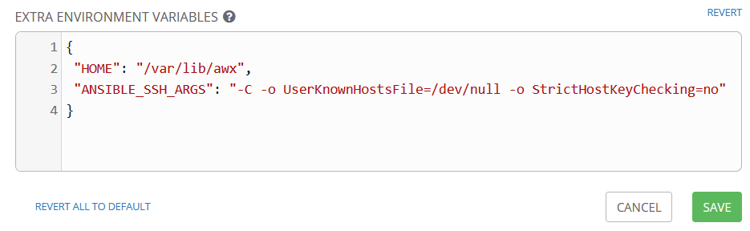

1. AWX, Tower Playbook fails when ssh host key changes
 
- AWX is not loading ansible.cfg - not clear why
- Worked around  by setting in the environment variables in the AWX GUI:
**Settings - Jobs -> Extra Environment Variables**
 `"ANSIBLE_SSH_ARGS": "-C -o UserKnownHostsFile=/dev/null -o StrictHostKeyChecking=no"`
 